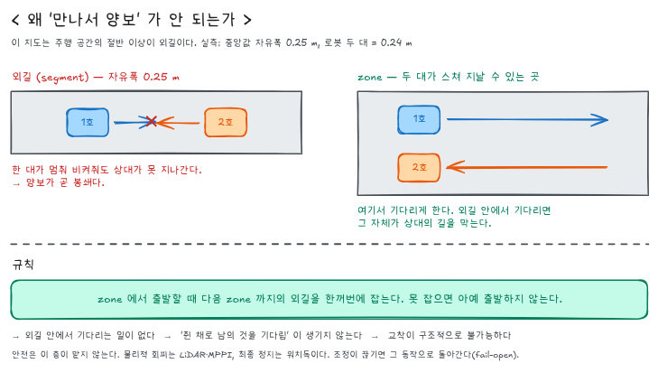
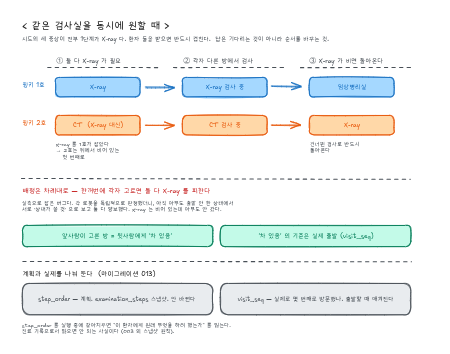

# 군집 조정 — 핑키 2대를 동시에 돌린다

핑키 2대가 같은 병원에서 각자 환자를 안내할 때 생기는 충돌을 어떻게 푸는가.

이 문서는 **구현된 것과 남은 것을 구분해서** 적는다. 구현 세부는 코드 주석에
있고, 여기에는 "왜 그렇게 했는가" 와 "무엇이 갈라지는가" 만 남긴다.

관련 문서 — [`monitoring-spec.md`](monitoring-spec.md)(관제·SLO) ·
[`nav2-debugging.md`](nav2-debugging.md)(주행 진단) ·
[`../config/event_codes.yaml`](../config/event_codes.yaml)(이벤트 정본)

---

## 1. 무엇을 하려는가

> 관제 화면에서 핑키 1호에 환자 한 명을 맡겨 주행시키고, 몇 분 뒤 핑키 2호에
> 두 번째 환자를 맡긴다. 그 사이에 벌어질 수 있는 일들이 사람 손 없이 풀려야
> 한다.

벌어질 수 있는 일은 셋이다.

| # | 상황 | 상태 |
|---|---|---|
| 1 | 좁은 구간에서 마주친다 | 구현 |
| 2 | 두 대의 경로가 겹친다 | 구현 |
| 3 | 같은 검사실을 동시에 원한다 | 구현 |

그리고 화면이 **왜 멈췄는지**를 말해야 한다. 이유가 안 보이면 의료진은 고장
으로 읽고 사람을 부르는데, 그 호출 하나하나가 §1.1 의 개입이라 완주율을 깎는다.

---

## 2. 이 지도에서는 '만나서 양보' 가 성립하지 않는다

설계가 여기서 갈렸다. 지도를 실측한 결과다.



```
주행 공간의 중앙값 여유      0.125 m   (= 자유폭 0.25 m)
로봇 두 대의 폭               0.24 m
두 대가 스쳐 지날 수 있는 면적   33.5%
```

절반이 넘는 구간에서 두 대가 **물리적으로 교차할 수 없다.** 그런 곳에서 한
대가 멈춰 비켜주면 상대는 지나가지 못한다 — **양보가 곧 봉쇄다.**

그래서 조정의 단위가 "만났을 때 누가 물러나나" 가 아니라 **"어느 구간에 지금
누가 들어가 있나"** 가 됐다.

측정은 `mingky_ros/mingky_bringup/scripts/build_fleet_segments.py` 가 한다.

---

## 3. 구간 지도 — 조정의 바탕

지도를 두 가지로 나눠 파일로 굽는다
(`config/fleet/<map>_segments.yaml`).

```
zone     두 대가 교차하거나 한 대가 기다릴 수 있는 넓은 곳     3개 · 1.694 m²
segment  한 대만 지나가는 외길. 배타 점유 단위               21개 · 1.315 m²
```

**zone 을 기다리는 자리로 쓰는 것이 요점이다.** 외길 안에서 기다리면 그게
봉쇄이므로, 못 잡으면 넓은 곳에서 기다린다.

### 왜 외길을 통째로 하나로 두지 않나

이 지도의 외길은 전부 이어져 있다. 하나로 묶으면 뮤텍스 하나가 주행 공간의
20% 를 잠그고, 그러면 충전소에 주차한 로봇이 X-ray 로 가는 복도까지 막는다.

그래서 외길을 한 셀 두께로 **세선화**하고 **분기점에서 자른다.** 가지 하나가
갈라지지 않는 통로 한 줄기이고, 서로 다른 가지에 있는 두 대는 마주칠 일이 없다.

### 왜 파일로 굽나

맵이 바뀌면 전부 다시 계산해야 하는 값이라 waypoint 와 성격이 같다. 실행할
때마다 계산하면 로봇과 서버가 서로 다른 구간 지도를 들고 판정하는 날이 온다.
**굽고 커밋하고, 맵을 바꾸면 다시 굽는다.**

```bash
ros2 run mingky_bringup build_fleet_segments.py --write --ascii
```

### 여유(clearance)로 '막는다' 를 판정하면 안 된다

처음에는 벽까지 여유가 좁으면 통행을 막는 것으로 봤다. 그런데 그 기준은
**넓은 홀의 벽 가장자리**와 **좁은 복도**를 구분하지 못한다 — 둘 다 여유가
작다.

실제로 오판이 났다. 충전소 두 곳은 여유가 0.075 m 라 '막는다' 로 분류됐는데,
셀 단위로 로봇을 세워 보면 한 대가 있어도 다른 대가 옆 도크까지 갈 수 있다.
예약층은 그 오판 때문에 **갈 수 있는 로봇을 세웠다.**

지금은 셀마다 로봇을 실제로 놓고 남은 공간이 끊기는지 본다.

```
여유로 판정      23곳 중 11곳이 '막는다'
실측으로 판정    23곳 중  1곳     (pharmacy_goal)
```

이 판정은 래스터로 함께 구워져 예약층이 좌표로 조회한다.

---

## 4. 이 층은 안전장치가 아니다

가장 먼저 못박아야 할 것이다.

| 역할 | 담당 |
|---|---|
| **물리적 충돌 회피** | LiDAR → local costmap → MPPI |
| **최종 정지** | twist_mux 워치독 · `mingky_battery_guard` 의 emergency_stop |
| **교착 예방** | 이 문서의 조정층 |

조정층이 내는 것은 `proceed` 뿐이고 **모터 명령은 없다.** 그래서 실패 방향이
정해져 있다 — 구간 지도가 없거나 위치를 모르거나 DB 가 흔들리면 조정을 하지
않는다(fail-open). 조정이 사라지면 이 기능을 붙이기 전 동작으로 돌아갈 뿐이고,
로봇이 위험해지지는 않는다.

### 데드맨 — fail-open 을 실제로 성립시키는 장치

서버는 매 프레임에 `ttl_sec` 을 실어 보내고, 로봇은 그 안에 갱신이 없으면
**스스로 푼다.** 이 설계에서 침묵은 '계속 서 있어라' 가 아니라 '조정이 없다' 다.

없으면 서버 버그 하나가 안내 중인 로봇을 영구히 세워 놓는다. `ttl(5초)` 이
`tick(1초)` 보다 넉넉한 것은 무선 구간에서 한두 프레임쯤은 정상적으로
없어지기 때문이다.

로봇 쪽에도 우선순위가 있다 — **비상정지 · 저전압 · 화재대피 > 환자 대기 >
군집 양보.** 세우는 이유는 집합으로 센다. 한쪽만 풀렸다고 출발하면 다른 쪽
이유가 그대로인데 움직이게 된다.

---

## 5. 배선

```
        위치 (0.5s)                         판정 (1s)
로봇 ──ws──> /robots/{id}/teleop/robot   /robots/{id}/fleet <──ws──> 로봇
              teleop_bridge                  mingky_fleet_agent
                   │                                │
                   v                                v
              fleet_pose ──┐              ┌── fleet_link
                           ├── fleet_reserve (구간)
              fleet_map ───┘              └── fleet_rooms  (검사실)
                   ^                                │
                   │                                v
        config/fleet/*_segments.yaml          화면 · 로봇
```

### 왜 링크를 따로 두나

`teleop_bridge` 에 얹을 수도 있었다. 소켓도 재접속 로직도 이미 거기 있다.
그런데 저쪽은 **사람이 로봇을 모는 통로**이고 이쪽은 **기계가 기계를 조정하는
통로**다. 한쪽이 죽을 때 다른 쪽이 같이 죽으면 안 된다.

`orders` 도 쓰지 않는다. 그쪽은 모든 명령을 `control_audit` 에 남기는데,
조정층은 사람이 아니라 기계라 감사 로그가 오염되고 SLO 판정까지 흔든다
(§1.1 의 "관리자 개입 없음").

### 관측을 조작에서 분리한 이유

화면이 두 대를 같이 보려면 위치가 필요하다. 그런데 조작자 소켓은 붙는 순간
`control_audit` 에 `teleop_attach` 를 남기고, 그 행동은 SLO 판정에서 **개입**
이다. 두 번째 로봇을 보려고 조작 소켓을 하나 더 열면 **보기만 했는데 그 로봇의
안내 세션이 실패로 집계된다.**

그래서 읽기 전용 채널을 따로 냈다 (`/fleet/poses/stream`). 이 경로로는 로봇에
아무것도 못 보내고, 감사 기록도 남지 않는다. 테스트가 그 부재를 지킨다.

---

## 6. 시나리오 1·2 — 마주침과 경로 겹침

### 규칙 하나가 교착을 구조적으로 불가능하게 만든다

> **zone 에서 출발할 때 다음 zone 까지의 외길을 한꺼번에 잡는다. 못 잡으면
> 아예 출발하지 않는다.**

이러면 외길 안에서 기다리는 일이 없고, '쥔 채로 남의 것을 기다리는'
(hold-and-wait) 순환이 생기지 않는다. 교착의 네 조건 중 하나가 구조적으로
제거되므로 교착은 발생할 수 없다.

### 판정 순서

1. **점유를 먼저 확정한다.** 지금 서 있는 자리는 사실이지 요청이 아니다.
   배정과 섞으면 우선순위가 높은 로봇에게 **상대가 지금 서 있는 복도를
   내주게 된다** — 실제로 그렇게 만들었다가 테스트가 잡았다.
2. **실제로 막는 자리에 선 로봇만 구간을 쥔다** (§3 참고).
3. 우선순위대로 다리(leg)를 배정한다. 못 잡으면 **아무것도 쥐지 않는다** —
   일부만 쥐고 기다리면 그게 hold-and-wait 이다.

### 우선순위

```
1. 환자를 안내 중인 로봇이 먼저
2. 그래도 같으면 robot_id 가 작은 쪽
```

2번은 임의다. **임의라는 것이 중요하다** — 규칙이 대칭을 깨지 않으면 두 대가
서로 양보하다 둘 다 멈춘다.

### 구조적 위험 지점 — 충전소

충전소 진입로는 **외길 막다른 길**이고 두 도크가 그 안에 있다. 두 대가 동시에
들어가면 빠져나올 방법이 없다. 예약이 가장 중요한 곳이라 구간 지도가
`dead_end: true` 로 표시한다.

> 참고 — 도크 좌표가 재측정되면서(#152) 두 도크는 서로를 막지 않게 됐다.
> 셀 단위 도달성 시험으로 확인했다. 다만 진입로 자체는 여전히 외길이라
> 동시 진입은 예약이 막는다.

---

## 7. 시나리오 3 — 같은 검사실

### 이건 공간 문제가 아니다

검사실 앞에 두 대가 나란히 설 수 있어도 **방은 한 번에 한 명만 받는다.**
구간 예약으로는 풀리지 않는다.

그리고 이건 예외가 아니라 기본이다. 시드의 세 증상이 전부 1단계가 X-ray 라
(`database/seeds/001_initial_data.sql`), 환자 둘을 받으면 **반드시** 겹친다.

```
퇴행성 무릎 관절염   X-ray → 임상병리실 → 물리치료실
단순 팔 골절         X-ray → CT
십자인대 파열        X-ray → MRI → 물리치료실
```



### 답은 기다리는 것이 아니라 순서를 바꾸는 것

"X-ray 가 차 있으니 CT 를 먼저." 건너뛴 검사로는 반드시 돌아온다.

규칙은 넷이다.

1. 앞의 것이 비어 있으면 굳이 안 바꾼다
2. 앞의 것이 차 있으면 뒤에서 비어 있는 첫 번째를 먼저 간다
3. **가는 중이면 목적지를 안 바꾼다** — 왔다 갔다 하면 환자가 못 따라온다
4. 전부 차 있으면 계획대로 두고 기다린다. 갈 곳이 없는 것과 기다리는 것은 다르다

### 여기서도 배정은 차례대로

각 로봇을 독립적으로 판정했더니 **아직 아무도 출발 안 한 상태에서 둘 다
X-ray 를 피했다.** 서로 상대가 쓸 것으로 보고 양보한 것이다. 통합 검증이
잡았다.

고친 방법이 둘이다.

- **차례대로 배정한다.** 앞사람이 고른 방이 뒷사람에게 '차 있음' 이 된다.
- **'차 있음' 의 기준을 실제 출발로 둔다.** 계획만 있는 방은 안 찬 것이다.

### 계획과 실제를 나눠 둔다 (마이그레이션 013)

순서를 바꾸면 방문 순서가 계획과 달라진다. 그렇다고 `step_order` 를 실행 중에
갈아치우면 **"이 환자에게 원래 무엇을 하려 했는가" 를 잃는다.** 그건 진료
기록으로서 잃으면 안 되는 사실이고, 003 이 `session_steps` 를 스냅샷으로 만든
이유이기도 하다.

```
step_order   계획 (examination_steps 스냅샷). 안 바뀐다
visit_seq    실제로 몇 번째로 방문했는가. 출발할 때 매겨진다
```

`visit_seq` 는 파생값이 아니다 — 이동 중에는 도착·완료 시각이 없어서
타임스탬프만으로는 "지금 어디로 가는 중인가" 를 복원할 수 없다.

`session_current_step` 뷰도 함께 바뀌었다. 기존 정의('완료 안 된 것 중
step_order 가 가장 작은 것')로는 로봇이 CT 에 있는데 화면이 X-ray 를 현재라고
말한다.

---

## 8. 화면

| 어디 | 무엇 |
|---|---|
| `/engineer/fleet` 전체 위치 | 핑키 2대를 한 지도에. 로봇마다 바닥 고리 + 이름표 |
| `/medical/:robotId` | 담당 로봇 옆에 **상대 로봇도** 함께 표시 |
| 지도 상태 배지 | `길 양보 중 · pinky-01 먼저` / `순서 변경 · X-ray 사용 중 · CT 먼저` |
| 진행 상황 스테퍼 | 계획과 실제가 갈린 단계에만 "2번째로 방문" |
| 이벤트 타임라인 | `fleet.yield_started` · `fleet.yield_ended` |

### 판정을 로봇에게 되묻지 않는다

화면은 `GET /fleet/coordination` 으로 **서버에게** 묻는다. 이 판정을 만든 것이
서버이므로 서버가 정본이고, 로봇을 거쳐 돌아오게 하면 같은 사실이 두 경로로
흘러 갈라진다.

다만 `linked` 가 거짓이면 화면이 양보 중이라고 말하지 않는다 — 판정을 못 받은
로봇은 그냥 달리고 있고, 서버 혼자 그렇게 생각하고 있을 뿐이다.

### 색은 두 화면이 같아야 한다

`lib/robotColors.ts` 가 정본이다. 같은 로봇이 화면마다 다른 색이면 색으로
알아보는 습관이 안 생긴다.

### 양보는 경보가 아니다

상태 배지의 tone 을 경보색으로 하지 않았다. 로봇이 스스로 양보한 것이라
장애가 아니고, 붉게 칠하면 의료진이 고장으로 읽고 사람을 부른다.

같은 이유로 `fleet.yield_*` 는 **SLO 판정에 넣지 않는다.** §1.1 은 사람의
개입만 센다. 개입으로 세면 조정이 잘 될수록 완주율이 떨어지는 거꾸로 된
지표가 된다.

다만 `fleet.yield_ended` 의 `reason=deadman` 은 장애 신호다 — 관제와의 링크가
끊겼다는 뜻이라, 이 비율이 오르면 조정이 사실상 꺼져 있다는 것을 알아야 한다.

---

## 9. 배포

**마이그레이션이 코드보다 먼저다.**

```bash
./deploy/deploy.sh migrate     # 013 적용
```

013 없이 새 백엔드가 뜨면 `visit_seq` 가 없어 ingest 의 상태 갱신이 조용히
실패하고, `session_current_step` 이 옛 정의라 순서 재정렬이 화면에 반영되지
않는다. 배치 자체는 세이브포인트가 막아주지만 기능은 안 먹는다.

`initdb.d` 는 **빈 볼륨 최초 생성 때만** 돌기 때문에 main 에 머지하거나
`deploy.sh up` 을 다시 해도 적용되지 않는다. 로컬 개발 DB
(`database/compose.yaml`) 는 `initdb.d` 마운트 자체가 없으므로 각자 적용해야
한다.

로봇 쪽에는 유닛이 하나 늘었다 (`mingky-fleet-agent.service`).
`deploy/robot/install.sh` 가 등록한다.

---

## 10. 검증

| 무엇 | 어떻게 |
|---|---|
| 예약 판정 | 순수 함수. 5×5×5×5 조합 전수로 "외길이 겹치지 않는다" 확인 |
| 데드맨 | 판정을 끊고 로봇이 스스로 푸는지 |
| 링크 배관 | 실제 uvicorn + 실제 `fleet_agent` 노드 2대(도메인 21/20) |
| fail-open | 백엔드를 `kill -9` 하고 즉시 `proceed: true` 가 나오는지 |
| 검사실 재정렬 | 실제 DB·이벤트로 두 세션을 겹치게 만들어 확인 |
| 화면 | 헤드리스 브라우저로 배지 문구를 DOM 에서 읽어 확인 |

로봇 없이 도는 것이 요점이다. 실기가 필요한 것은 아래 남은 항목뿐이다.

### 하네스로 재현하기

```bash
# 0) PATH 에서 venv 를 빼야 colcon·ros2 가 시스템 python 을 쓴다
export PATH=$(echo "$PATH" | tr ":" "\n" | grep -v "backend/.venv" | paste -sd:)
source /opt/ros/jazzy/setup.bash && source install/local_setup.bash

# 1) 백엔드 (구간 지도를 물려준다)
FLEET_SEGMENTS_FILE=$PWD/mingky_ros/mingky_bringup/config/fleet/yun_map_highres_clean_segments.yaml \
  backend/.venv/bin/uvicorn app.main:app --port 8000

# 2) 두 대 heartbeat + 두 세션
python tools/fake_robot/fake_robot.py \
  tools/fake_robot/scenarios/two_pinky_concurrent.yaml --base-url http://localhost:8000

# 3) 에이전트는 도메인이 달라야 한다 (실기와 같은 구성)
ROS_DOMAIN_ID=21 ros2 run mingky_fleet_agent fleet_agent --ros-args \
  -p backend_url:=http://127.0.0.1:8000 -p robot_id:=pinky-01
ROS_DOMAIN_ID=20 ros2 run mingky_fleet_agent fleet_agent --ros-args \
  -p backend_url:=http://127.0.0.1:8000 -p robot_id:=pinky-02
```

> 손으로 목표를 넣어볼 때는 QoS 를 맞춰야 한다. `ros2 topic pub` 기본이
> `VOLATILE` 인데 구독자는 `TRANSIENT_LOCAL` 이라 그냥 하면 **조용히 아무 일도
> 안 일어난다.**
>
> ```bash
> ros2 topic pub -1 --qos-durability transient_local --qos-reliability reliable \
>   /guide_manager/fleet_intent std_msgs/String \
>   'data: "{\"goal_waypoint\": \"charging_station_1\", \"guiding\": true}"'
> ```

---

## 11. 남은 것

| 항목 | 왜 아직인가 |
|---|---|
| **실기 검증 — Nav2 목표 취소** | 액션 서버가 필요하다. 단위 테스트로만 확인했다 |
| **실기 검증 — AMCL 오차 대 구간 판정** | **가장 큰 미지수.** 도크 여유가 0.075 m 라 위치가 몇 cm 튀면 구간 판정이 뒤집힌다. 완화책(경계 근처에서 이웃 구간까지 잡기)은 절반 들어가 있지만 여유를 얼마로 할지는 실측 없이 못 정한다 |
| 후진 양보 | 예약이 늦어 마주쳤을 때의 최후 수단. `behavior_server` 에 `backup` 이 이미 있고 `low_obstacle_driver` 에 실행 패턴이 있어 재사용하면 된다 |
| 과잉 대기 측정 | `fleet.yield_started` 의 `segment` 로 "어느 구간에서 헛대기가 잦은가" 를 집계 |

### 별건 — 확인이 필요한 것

`MedicalDashboard` 가 로봇을 고르는 순간 조작 소켓을 열고, 서버는 붙는 즉시
`teleop_attach` 를 남기며, 그건 `INTERVENTION_ACTIONS` 라 그 세션이
`operator_order` 실패로 잡힌다. **코드를 읽은 추론이고 아직 관측하지 못했다** —
로컬 DB 에 `teleop_attach` 가 한 건도 없었다.

세션 중에 `/medical/:robotId` 를 열어두고 아래를 보면 확인된다.

```sql
SELECT * FROM control_audit WHERE action = 'teleop_attach';
```

행이 생기면 실제 문제이고, 그때 정할 것은 **"화면을 열어둔 것이 개입인가"** 다.

---

## 부록 — 다이어그램

| 파일 | 무엇 |
|---|---|
| [`diagrams/fleet-corridor-conflict.excalidraw`](./diagrams/fleet-corridor-conflict.excalidraw) | 외길에서 왜 양보가 봉쇄가 되는가 · 예약 규칙 |
| [`diagrams/fleet-room-reorder.excalidraw`](./diagrams/fleet-room-reorder.excalidraw) | 검사실 겹침 → 순서 재정렬 · 계획과 실제의 분리 |

**원본(.excalidraw)을 PNG 와 같이 둔다** — PNG 만 남기면 다음 사람이 고칠 수
없다 (`qr-scan-sequence` 와 같은 규칙).

고칠 때는 Excalidraw 에서 원본을 열어 손보고 `Export image` 로 PNG 를 다시
내보낸다. **폰트는 5 여야 한다** — 1(손글씨체)에는 한글 글리프가 없어 통째로
깨진다.
