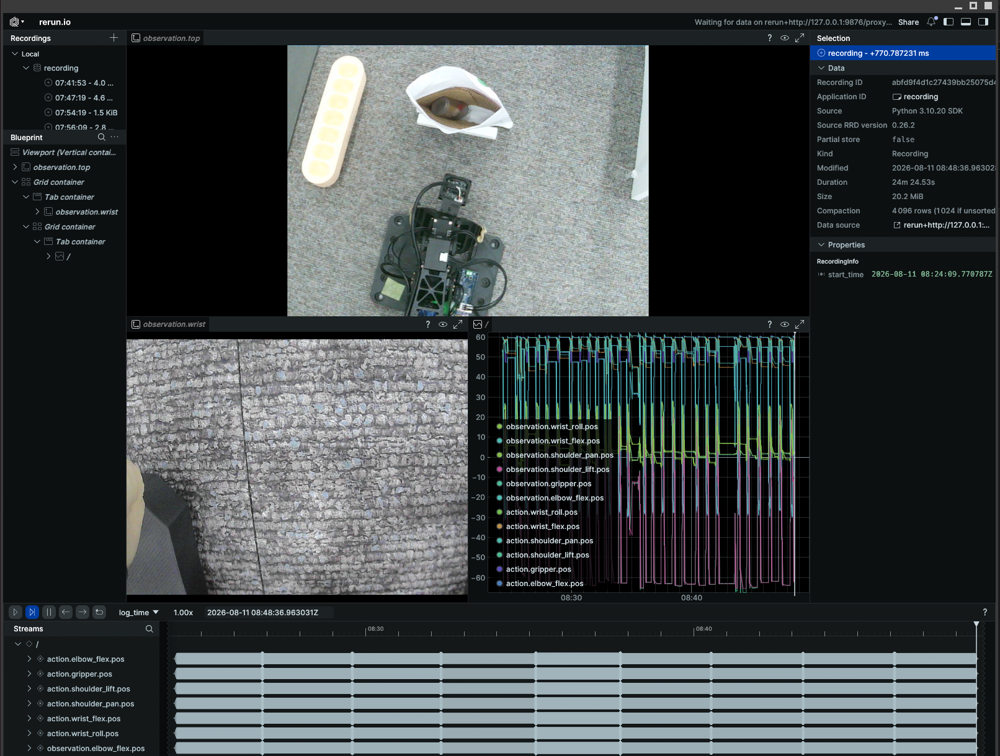

# OMX 모방학습 — 알약통 봉투 넣기

OpenManipulator-X 로 알약이 담긴 약통을 집어 봉투에 넣는 동작을 모방학습으로 만들었다.
이 문서는 **무엇을 어떤 순서로 했고, 왜 그렇게 했으며, 무엇이 아직 확인되지 않았는지**를
남긴다. 나중에 같은 작업을 다시 하는 사람(팀원이든 몇 주 뒤의 본인이든)이 같은 함정을
다시 밟지 않는 것이 목적이다.

작업 정의·성공 기준·세팅 기준선은 [`omx/il/TASK.md`](../omx/il/TASK.md) 가 정본이고,
증상별 대처는 [`omx/il/TROUBLESHOOTING.md`](../omx/il/TROUBLESHOOTING.md) 에 있다.

---

## 1. 결과 요약

| 항목     | 값                                                |
| -------- | ------------------------------------------------- |
| 작업     | `put the pill bottle in the envelope` (단일 목표) |
| 데이터   | 29 에피소드 / 20,061 프레임 / 30fps               |
| 정책     | ACT (파라미터 5,160만)                            |
| 학습     | 40,000 스텝 = 31.9 에폭, batch 16, 5시간 24분     |
| 손실     | 6.082 → **0.052** (grad norm 120 → 4.4)           |
| 평가     | 9 회차 기록, **시도한 것은 전부 성공**            |
| 1회 소요 | 약 20초 (사람 시연 22.8초와 같은 수준)            |

**파이프라인이 처음부터 끝까지 한 바퀴 돌았다는 것**이 이번 작업의 성과다.
성공률은 수치로 말할 수 없다 (이유는 [7절](#7-평가)에)

---

## 2. 파이프라인

각 단계가 하는 일과 소요 시간은 [`omx/il/README.md`](../omx/il/README.md) 를 본다.
이 절은 킷에 없던 것과 순서에 낀 것만 다룬다.

- **`03_focus.sh`** (새로 추가) — 렌즈 링을 돌리는 동안 선명도를 실시간으로 출력한다.
  최고점을 지나면 막대가 줄어들어 눈으로 보인다. 측정 방식은 `03_check_cameras.py` 의 열기
  함수를 그대로 가져다 써서 두 도구의 숫자가 항상 비교 가능하다.
- 예비 녹화 5개 단계 (순서에 낌) — 30~50개를 다 찍은 뒤 카메라 키 오타나 fps 미달을
  발견하면 전량 재촬영이다. 5개만 먼저 찍고 `08_check_data.py` 로 파이프라인을 검증한
  뒤 본 녹화에 들어갔다.
- **`08_check_data.py` 를 06 학습 앞으로 당김** — 번호는 08 이지만 학습 전에 돌린다.

---

## 3. 환경

|         |                                                                                     |
| ------- | ----------------------------------------------------------------------------------- |
| OS      | Ubuntu 24.04 (Wayland)                                                              |
| GPU     | RTX 5080 Laptop 16GB (sm_120)                                                       |
| torch   | 2.10.0+cu128                                                                        |
| LeRobot | **v0.4.4 고정** (`8fff0fde`) + 로컬 패치                                            |
| 로봇    | OMX 리더-팔로워 (Dynamixel, 팔로워 모터 11~16 / 리더 1~6)                           |
| 카메라  | top = Jieli USB Composite / wrist = Innomaker U20CAM-720P, 둘 다 640×480 MJPG 30fps |

LeRobot 을 v0.4.4 에 고정한 이유는 최신 0.6.x 가 CLI 체계가 달라 이 스크립트들이 맞지
않기 때문이다. 업그레이드하려면 스크립트를 함께 고쳐야 한다.

**학습 전에 GPU 호환성을 실측했다.** RTX 5080 은 sm_120 이라 torch 빌드가 지원하지 않으면
몇 시간 뒤 커널 오류로 죽는다. 행렬곱과 AMP 를 직접 돌려 통과를 확인한 뒤 시작했다.

---

## 4. LeRobot 로컬 패치

upstream 을 그대로 쓰지 않는다. [`omx/il/lerobot_local_v0.4.4.patch`](../omx/il/lerobot_local_v0.4.4.patch)
가 5개 파일을 고치며, `01_install.sh` 가 적용한다.

| 수정                      | 막는 사고                                                          | 출처 |
| ------------------------- | ------------------------------------------------------------------ | ---- |
| USB 카메라 재연결         | 카메라가 잠깐 빠지면 실행이 죽으면서 찍던 에피소드가 통째로 날아감 | 킷   |
| 저장·인코딩을 리셋 앞으로 | 리셋 끝에 `→` 를 누르면 다음 에피소드가 0프레임으로 저장됨         | 킷   |
| 첫 에피소드도 `→` 대기    | 연결되자마자 1번 에피소드가 시작되어 준비 전에 녹화됨              | 킷   |
| ACT `film_conditioning`   | 목표 조건화가 무시되는 문제 (아래)                                 | 킷   |
| DAgger 개입               | 평가 중 스페이스바로 사람이 정책을 넘겨받아 교정 시연을 남김       | 로컬 |
| Wayland stdin 키 입력     | pynput 전역 후킹이 Wayland 에서 이벤트를 못 받음                   | 로컬 |

### 병합에서 배운 것

로컬 lerobot 에 **이미 DAgger·Wayland 수정이 들어가 있어서 킷 패치가 그대로 적용되지
않았다.** 그런데 `01_install.sh` 는 이 경우 경고만 남기고 조용히 넘어가도록 되어 있었다.
그대로 진행했다면 패치 없는 lerobot 으로 녹화를 시작해서, 0프레임 에피소드나 카메라
끊김으로 데이터를 잃은 뒤에야 알아차렸을 것이다.

파일별로 손으로 병합하고, 결과를 다시 `git diff` 로 뽑아 패치 파일을 재생성했다.
깨끗한 v0.4.4 에 적용되는지는 임시 worktree 로 검증했다.
**그리고 `01_install.sh` 가 패치 실패 시 멈추도록 고쳤다** — 무엇이 걸리는지와 병합
방법을 출력한 뒤 종료한다.

### FiLM 목표 조건화 — 이번에는 껐다

목표를 `observation.environment_state` 토큰으로 주는 기본 방식은 **실측에서 무시됐다는
기록이 패치 주석에 남아 있다** (원-핫·언어 모두 자기 목표 대비 1.00배). 목표 토큰이
인코더 입력 603개 중 1개(0.17%)라 무시해도 손실이 거의 늘지 않기 때문이다.

`film_conditioning=true` 를 켜면 목표가 시각 특징맵의 모든 채널을 변조한다
(`f' = (1 + γ(goal))·f + β(goal)`, BC-Z/RT-1 방식).

**이번 작업은 목표가 하나(약통 1종 → 봉투 1개)이므로 껐다.** 여러 약통 중 고르거나
트레이 칸을 지정해야 할 때 켜면 된다. 기본값이 꺼짐이라 기존 체크포인트와 호환된다.

---

## 5. 데이터 수집

|           |                                                      |
| --------- | ---------------------------------------------------- |
| 데이터셋  | `mingky/pill_bottle_v1`                              |
| 최종      | 29 에피소드 / 20,061 프레임 (11.1분)                 |
| 길이      | 중앙값 22.8초, 표준편차 2.7초, 범위 18.4~28.2초      |
| 저장 위치 | `~/.cache/huggingface/lerobot/mingky/pill_bottle_v1` |

에피소드 시간 상한을 `EP=30` 으로 줄여 잡았다. 기본값 60초로 찍었을 때 상한에 걸린
에피소드가 나왔기 때문이다 — 시간이 다 돼서 잘린 에피소드는 끝부분에 목적 없는 움직임이
들어가 학습에 좋지 않다.

### 녹화 중 화면

`--display_data=true` 로 켜지는 rerun 창이다. 두 카메라와 관절 궤적을 한 화면에서 본다.



- **`observation.top`** — 작업대를 내려다보는 고정 카메라. 약통·봉투·로봇이 다 들어와야 한다
- **`observation.wrist`** — 팔에 달린 카메라
- **오른쪽 그래프** — `observation.*.pos`(팔로워 실제 각도)와 `action.*.pos`(리더가 준 목표)가
  6관절 + 그리퍼별로 겹쳐 그려진다. 둘이 벌어지면 팔로워가 못 따라가고 있다는 뜻이다

이 화면에서 매 에피소드 시작 전에 **두 카메라가 다 나오는지** 확인한다. 한쪽이 검으면
껐다 다시 시작하는 편이 낫다 — 검은 화면으로 찍힌 에피소드는 나중에 걸러내야 한다.

> 위 캡처에서 wrist 화면에 그리퍼가 보이지 않는다. 세팅 단계에서 확인을 건너뛴 항목이고,
> [10절](#10-아직-확인하지-않은-것)에 미확인으로 남겨두었다.

### 지킨 규칙

- **파지 자세를 일관되게.** 매번 다르면 "근처까지 가는데 못 잡는" 정책이 된다
- **회복 시연은 넣지 않거나 10% 이하.** 많이 넣으면 물건이 없을 때 멈추는 법을 못 배운다
  (회복 능력과 정지 조건은 맞바꿈 관계다)
- 마음에 안 드는 시연은 **그 자리에서 `←`** 로 버린다. 나중에 지우는 것보다 싸다

### 에피소드 삭제

30개를 찍은 뒤 시간 상한에 걸린 1개(15번)를 지웠다. LeRobot 은 카메라당 mp4 한 파일에
에피소드를 이어붙여 저장하므로 파일을 지우는 방식으로는 안 되고, 전용 도구를 쓴다.

```bash
lerobot-edit-dataset \
  --repo_id mingky/pill_bottle_v1 \
  --operation.type delete_episodes \
  --operation.episode_indices "[15]"
```

원본은 `<이름>_old` 로 자동 백업되고, 남은 에피소드는 0부터 재인덱싱된다.
이 작업으로 표준편차가 3.5초 → 2.7초로 줄었다.

### 학습 전 검증

`08_check_data.py` 로 다음을 확인한 뒤에만 학습에 들어간다.

- 에피소드 수 — 중간에 죽어 저장이 안 된 것이 없는지
- 길이 분포 — 유난히 짧은(실수로 넘긴) / 긴(상한에 걸린) 에피소드
- **카메라 키가 `top`/`wrist` 인지** — 학습과 평가에서 같아야 한다
- **작업 문자열이 하나로 통일됐는지** — 섞이면 되돌릴 수 없다

---

## 6. 학습

```bash
RUN=act_pill_bottle_v1 bash omx/il/06_train.sh
```

|            |                                                            |
| ---------- | ---------------------------------------------------------- |
| 정책       | ACT, ResNet18 백본 (ImageNet 사전학습)                     |
| 스텝       | 40,000 = **31.9 에폭** (1 에폭 = 20,061 ÷ 16 = 1,254 스텝) |
| batch      | 16 (VRAM 16.3GB 기준 자동 선택)                            |
| chunk_size | 100 (한 번 판단하면 100스텝 ≈ 3.3초치 동작을 이어서 실행)  |
| 증강       | `image_transforms.enable=true`                             |
| 소요       | 5시간 24분, GPU 100% / VRAM 8.7GB / 70~75°C                |

### 손실

|   스텝 |  에폭 |      loss | grad norm |
| -----: | ----: | --------: | --------: |
|    200 |  0.16 |     6.082 |     120.2 |
|  5,000 |  3.99 |     0.221 |      16.3 |
| 10,000 |  7.98 |     0.126 |      10.4 |
| 20,000 | 15.95 |     0.078 |       6.7 |
| 30,000 | 23.93 |     0.063 |       5.3 |
| 40,000 | 31.90 | **0.052** |       4.4 |

전 구간 단조 감소, 발산·정체·재상승 없음. 체크포인트는 8,000 스텝(6.4 에폭)마다
5개 + `last` 가 `~/train/act_pill_bottle_v1/checkpoints/` 에 남는다.

**낮은 손실이 곧 좋은 정책은 아니다.** 시연을 잘 재현한다는 뜻일 뿐이고, 새로운 약통
위치에서 되는지는 실기로만 알 수 있다.

### 증강을 끄지 않는 이유

같은 데이터를 32번 반복해서 본다. 증강이 없으면 매번 완전히 같은 그림이라 "이 화면 =
이 궤적"으로 통째로 외우고, 무엇을 보고 판단해야 하는지를 배우지 않는다.
**증강은 데이터를 늘리는 장치가 아니라 외우는 지름길을 막는 장치다.**

### 학습 전 체크

- 노트북 절전 해제 (5시간 걸린다)
- 로봇·카메라는 필요 없다
- 출력 디렉터리가 이미 있으면 `06_train.sh` 가 거부한다. `RUN=` 으로 다른 이름을 준다

---

## 7. 평가

```bash
sg dialout -c "RUN=act_pill_bottle_v1 bash omx/il/07_run.sh 10"
```

**시도한 것은 전부 성공했다.** 한 번 옮기는 데 20초 내외로, 사람 시연(22.8초)과 같은
수준이다. 결과는 `mingky/eval_pill_bottle_v1` 에 9회차분이 남아 있어 영상으로 복기할 수 있다.

### 성공률을 수치로 말할 수 없는 이유

한 회차 안에서 두 번 옮긴 경우가 있어 **회차 수와 시도 수가 어긋났다.** 그래서
성공률을 "X회 중 Y회" 로 판정할 수 없다.
(회차 평균이 47.2초로 나온 것도 이 때문이지, 정책이 느린 것이 아니다.)

**재측정하지 않는다** — "시도한 것은 전부 성공"이라는 정성 판정이 이 작업의 결론이다.

### 평가 전에 맞춰야 하는 것

카메라 화각이 녹화 때와 다른 것이 실패의 가장 흔한 원인이다. 이번에는 **녹화 영상의
프레임과 실시간 화면을 위상 상관으로 비교**해서 확인했다.

```
화각 이동: dx = -0.24px, dy = +0.70px   → 1픽셀 미만, 동일
밝기 157.8 → 161.9,  색 균형 B/G/R 157/160/153 → 160/164/158
```

이때 **프레임 하나만 잡아 비교하면 안 된다.** 카메라 자동노출·화이트밸런스가 수렴하기
전 프레임은 어둡고 색이 틀어져 있어서, 멀쩡한 카메라를 고장으로 오진한다.
90프레임쯤 워밍업한 뒤 측정한다.

### DAgger 개입

리더 팔을 꽂아 두면 평가 중 **스페이스바로 사람이 개입**할 수 있다. 켜는 순간 리더가
팔로워 자세로 자동 정렬되므로 1.5초간 리더에서 손을 뗀다. 개입한 시간은 에피소드 시간
상한에서 빠진다. 정책이 자꾸 틀리는 구간만 골라 교정 시연을 모을 수 있어서, 처음부터
다시 찍는 것보다 효율적이다.

**개입한 회차는 성공·실패 어느 쪽으로도 세지 않는다.**

---

## 8. 겪은 문제

실제로 시간을 쓴 것만 적는다.

| 증상                                        | 진짜 원인                                                                                                         | 조치                                                                             |
| ------------------------------------------- | ----------------------------------------------------------------------------------------------------------------- | -------------------------------------------------------------------------------- |
| `02_find_ports.sh` 가 팔을 못 찾음          | dialout 그룹 미적용. 스크립트는 "케이블을 의심하라"고 안내했다                                                    | `omx_scan.py` 가 권한 오류를 가려내 `newgrp`/재로그인을 안내하도록 수정          |
| top 카메라가 완전한 검은 화면 (모든 픽셀 0) | USB. 로봇 팔 2대와 **같은 허브**에 물려 있었고 여섯 번 재열거된 흔적                                              | 카메라를 노트북에 직결, 팔만 허브에. 자동절전도 끔                               |
| `--view` 가 GTK 오류로 죽음                 | lerobot 이 `opencv-python-headless` 를 요구해 `cv2.imshow` 가 없음                                                | GUI 유무를 판정해 `ffplay` 로 대체. GUI 버전 opencv 는 의존성 충돌이라 쓰지 않음 |
| 녹화 키가 안 먹음                           | 백그라운드 실행은 tty 가 없어 stdin 리스너가 동작하지 않음                                                        | 실제 터미널 창(`gnome-terminal`)에서 실행                                        |
| **평가가 시작하자마자 죽음**                | lerobot 은 정책을 줄 때 데이터셋 이름이 **`eval_` 로 시작**하길 요구하는데, `07_run.sh` 는 `_eval` 을 뒤에 붙였다 | `mingky/eval_pill_bottle_v1` 로 수정 (킷의 실제 버그)                            |
| 카메라가 방금 전까지 되다가 "열기 실패"     | `udevadm trigger` 가 카메라까지 재열거함                                                                          | `02_find_ports.sh` 직후에 흔하다. 몇 초 기다렸다 재시도                          |

### 진단에서 지킨 것

- **재학습은 진단이 아니다.** 원인을 지목한 뒤에 재학습한다
- **한 번에 하나만 바꾼다.** 두 개를 같이 바꾸면 뭐가 효과였는지 모른다
- **되는 상태를 먼저 저장한다.** 고치기 전에 백업/커밋
- 오진했으면 정정한다. "카메라가 죽었다"고 판단했던 것이 워밍업 문제였고, "USB 재열거
  때문에 녹화가 죽는다"고 본 것도 실제로는 다른 원인이었다. 감시 로그를 걸어 두고
  증거로 판정했다

---

## 9. 재현 방법

```bash
# 1) 설치 — 끝나면 로그아웃 → 로그인 (dialout 반영)
bash omx/il/01_install.sh

# 2) 포트 고정 (sudo 필요, 대화형)
bash omx/il/02_find_ports.sh

# 3) 카메라 확정 + 초점
bash omx/il/03_check_cameras.sh --view
bash omx/il/03_focus.sh top          # 선명도 100 이상, 가능하면 1000 근처
#    맞춘 뒤 카메라 본체와 렌즈 링을 테이프로 고정 (렌즈 앞면은 덮지 않게)

# 4) 하드웨어 확인
bash omx/il/04_teleop.sh --cam

# 5) 예비 5개 → 검증 → 본 녹화
EP=30 bash omx/il/05_record.sh 5
python omx/il/08_check_data.py
EP=30 bash omx/il/05_record.sh 25 resume

# 6) 학습
RUN=act_pill_bottle_v1 bash omx/il/06_train.sh

# 7) 평가
RUN=act_pill_bottle_v1 bash omx/il/07_run.sh 10
```

`dialout` 이 아직 반영되지 않은 셸에서는 앞에 `sg dialout -c "..."` 를 붙인다.
작업·데이터셋 이름은 `omx/il/_common.sh` 의 `REPO` / `TASK` 두 줄로 정한다.

---

## 10. 아직 확인하지 않은 것

이번 작업이 답하지 **못한** 것들이다.

1. **위치 일반화** — 격자 가장자리나 학습에 안 쓴 각도에서도 되는지. 데이터 29개는
   적은 편이라 여기가 가장 약할 지점이다
2. **wrist 화각** — 그리퍼가 화면에 잡히는지 세팅 단계에서 확인을 건너뛰었다.
   [5절의 rerun 캡처](#녹화-중-화면)를 보면 wrist 화면에 카펫만 보이고 그리퍼가 없다.
   이번에는 잘 됐지만, "근처까지 가는데 못 잡는" 증상이 나오면 여기를 먼저 본다
3. **정지 조건** — 약통이 없을 때 멈추는지 시험하지 않았다

## 다음 단계

- **위치 일반화 시험** — 일부러 안 써본 자리에 놓고 10회, 한 회차 한 시도로
- **ROS 연동** — [`config/event_codes.yaml`](../config/event_codes.yaml) 의 비어 있는
  `omx.*` 섹션을 채운다. 설계 질문은 그 파일에 이미 적혀 있다: 조제가 특정 환자 세션에
  속하면 `session_id` 를 채우고, 독립적으로 돌면 0
- **다중 목표 확장** — 여러 약통 중 고르기. 그때 `film_conditioning=true` 를 켜고,
  데이터셋 이름을 새로 만든다 (목표당 30개 전후 필요)
