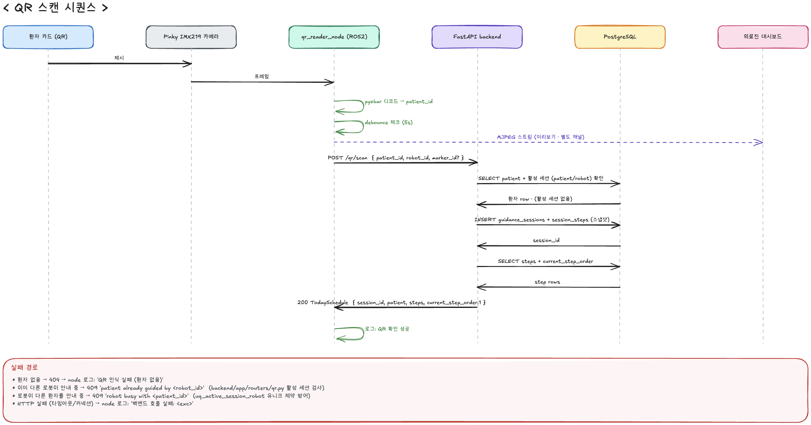

# QR 스캔으로 환자 확인하기

간호사(의료진)가 환자의 QR 카드를 Pinky 로봇에 인식시켜 오늘 진료 일정을
로드하고 안내 세션을 여는 흐름을 정리한 문서입니다. 설계 배경, 각 계층의
역할, 사용한 기술 스택의 선택 이유, 개발 중 부딪힌 문제와 해결을 함께
담았습니다.

시퀀스 다이어그램:



## 1. 시나리오 요약

의료진이 대시보드에서 담당 Pinky 를 선택하면 그 로봇의 QR 스캔이 켜지고,
환자가 자기 이름이 적힌 QR 카드를 로봇 후방 카메라에 대면 백엔드가 오늘
진료 일정을 응답으로 내려줍니다. 로봇은 이 응답으로 안내 세션을 시작하고,
의료진 화면은 "QR 인식되었습니다" 확인 화면을 거쳐 진행 화면으로 넘어갑니다.

시스템은 세 계층으로 나뉩니다.

| 계층       | 역할                                     | 기술                                         |
| ---------- | ---------------------------------------- | -------------------------------------------- |
| 프론트엔드 | 의료진 대시보드. 로봇 선택·상태 모니터링 | React + TypeScript + Vite                    |
| 백엔드     | 상태 정본이자 매개 지점                  | FastAPI + asyncpg + PostgreSQL               |
| 로봇       | QR 인식, 백엔드 요청, 안내 상태 관리     | ROS2 Jazzy, pyzbar, Picamera2, Flask (MJPEG) |

**설계 원칙: 프론트와 로봇은 직접 통신하지 않습니다.** 백엔드가 유일한
매개이며, 카메라 실시간 스트림 한 채널만 예외입니다.

## 2. 준비 단계 · 로봇 활성화 (arming)

QR 리더가 항상 켜져 있으면 지나가는 아무 QR 카드나 스캔되어 엉뚱한 세션이
열릴 수 있습니다. 그래서 의료진이 로봇을 명시적으로 선택하기 전까지 로봇은
카메라 프레임을 캡처조차 하지 않습니다.

흐름:

1. 의료진이 [`RobotPicker`](../frontend/src/components/RobotPicker.tsx) 에서 로봇 카드를 클릭
2. 프론트가 `POST /robots/{id}/arm` 호출
3. 백엔드가 검증 (등록·활성·주행 로봇·유휴·배터리 40% 이상·5분 이내 표본)
4. 통과하면 인메모리 레지스트리 ([`app/arming.py`](../backend/app/arming.py)) 에 기록하고 `activation.armed` 이벤트를 남김
5. 로봇 QR 노드가 2초 주기로 `GET /robots/{id}/arming` 폴링해 armed 인지 확인
6. 스캔이 성공해 세션이 만들어지면 백엔드가 arming 을 소비(consume)해 자동 해제

**왜 DB 가 아니라 인메모리인가:** arming 은 초~분 단위의 휘발성 상태라
영속화의 이득이 없습니다. 감사 기록은 `activation.armed / consumed / canceled`
이벤트가 `events` 테이블에 남아 이중 안전망 역할을 합니다. 단일 uvicorn
워커 전제이며, 확장 시 Redis 로 이관할 예정입니다.

**페일세이프:** 로봇의 arming 폴링이 5회 연속 실패하면 스스로 disarmed
로 떨어져, 백엔드 두절 상태의 낡은 캐시가 유효한 것처럼 남아 있다가 튀는
위험을 막습니다.

## 3. QR 인식 단계

### 카메라 위치

Pinky 는 환자보다 앞장서서 안내하므로 환자는 로봇 뒤에 있습니다. 전방 CSI
카메라로는 환자가 매번 앞으로 돌아와야 하므로, QR 인식용으로 로봇 후방에
별도 카메라를 달았습니다.

### 노드 처리 (`qr_reader_node`)

`_tick()` 이 10Hz 주기로 다음을 수행합니다.

1. 최초 QR arming 또는 검사실 waiting 스캔 창이 모두 닫혔으면 즉시 리턴
2. `_read_frame()` 으로 최신 프레임 획득
3. `pyzbar.decode(frame, symbols=[ZBarSymbol.QRCODE])` 로 디코드
4. 미리보기가 켜져 있으면 인식 박스·라벨을 얹어 MJPEG 로 송출
5. debounce (5초 내 같은 값 무시) 통과하면 `POST /qr/scan` 호출

QR 페이로드는 지금은 `patient_id` 평문(예: `p001`)입니다. MVP 데모용이며,
위조 카드로 세션이 열리는 위험은 arming(사람 확인) 이 방어합니다. 배포 전
서명 토큰으로 교체할 예정입니다.

### MJPEG 미리보기 · 왜 별도 채널인가

의료진 화면의 "카메라에 QR 을 대주세요" 카드가 실제 로봇 시야를 보여줘야
합니다. 카메라 리소스는 한 프로세스만 열 수 있어 별도 카메라 서버를 띄울
수 없으므로, QR 노드가 Flask 내장 서버로 MJPEG (`multipart/x-mixed-replace`)
를 송출하고 브라우저는 `` 로 임베드합니다.

이 스트림만 로봇 → 프론트 직접 통신입니다. 영상은 대역폭이 크고 저지연이
필요해 백엔드 릴레이가 낭비이기 때문입니다.

## 4. 백엔드 처리 · `POST /qr/scan`

로봇↔백엔드 통신은 원칙적으로 로봇이 발행하는 단방향 이벤트 (`POST /events`
배치) 로 통일했습니다. **QR 스캔만 유일하게 요청·응답 방식입니다.** 이유는
로봇이 `session_id` 를 즉시 알아야 하기 때문입니다. 이후 발행하는 모든
이벤트가 이 값을 달고 다녀야 어느 세션에 귀속되는지 식별됩니다.

### 처리 순서 ([`backend/app/routers/qr.py`](../backend/app/routers/qr.py))

```
1. patient 조회 → 없으면 404
2. 트랜잭션 시작
   a. 이 환자의 활성 세션?
      - 같은 로봇이면 → 기존 session_id 반환 (재스캔 안전)
      - 다른 로봇이면 → 409
   b. 이 로봇의 활성 세션? → 409
   c. 새 세션 경로
      - armed 아니면 → 409
      - INSERT guidance_sessions
      - examination_steps → session_steps 스냅샷 복사
      - activation.consumed 이벤트 기록
3. 커밋 후 인메모리 arming 해제
4. TodaySchedule 응답 (session_id, patient, steps, current_step_order)
```

**활성 세션을 미리 조회하는 이유:** `003_sessions_and_events.sql` 의 부분
유니크 인덱스가 이미 활성 세션을 로봇당·환자당 하나로 강제하지만, 미리
걸러내지 않으면 INSERT 가 터져 500 이 되고 원인이 드러나지 않습니다.
미리 SELECT 해서 409 로 정확한 이유를 돌려줍니다.

**세션 스텝을 스냅샷 복사하는 이유:** `examination_steps` 마스터를 매번
조인하면, 나중에 검사 순서가 바뀔 때 과거 안내 기록의 일정이 소급해서
달라집니다. 세션 시작 시점의 일정이 그대로 보존되도록 스냅샷으로 분리
했습니다.

**재스캔이 안전한 이유:** 같은 환자·같은 로봇의 재스캔은 새 세션을 만들지
않고 기존 세션을 그대로 돌려줍니다. 로봇 재부팅·통신 두절 복구 시 자동
재개됩니다.

## 5. 로봇 내부 배관 · `SessionStart` 전달

백엔드가 로봇으로 push 하는 채널은 따로 없기 때문에, QR 응답 본문을 파싱해
로봇 안의 다른 노드(`guide_manager`) 에 `SessionStart` ROS 메시지로
흘려보냅니다.

`SessionStart` 필드:

- `session_id` — 이후 모든 이벤트가 이 값을 달고 다닙니다
- `patient_id`
- `current_step_order` (1-based)
- `visit_names[]` — step_order 순서의 방문지 이름 배열

`guide_manager` 는 최초 메시지를 받으면 `patient_confirmed`로 저장하고
`session.ready`를 발행한 뒤 관제 출발 명령을 기다립니다. 의료진 화면에서
**안내 시작**을 누르면 백엔드가 활성 세션과 로봇의 일치 여부를 검증하고,
Event Gateway가 `/guide_manager/start_guidance`로 세션 ID를 전달합니다.
Guide Manager가 세션 상태·배터리·비상정지·Waypoint를 다시 검증한 뒤
첫 목적지로 출발합니다. 출발 후에는 각 검사실의 `goal` 도착을
기록하고 `waiting` 위치로 이동합니다. 이 상태에서만 QR 스캔을 다시
열며, 같은 환자·세션이 재인식되면 `session.step_completed`를
발행하고 다음 검사실로 출발합니다. 마지막 단계에서는
`session.ended(completed)`를 발행하고 안내를 종료합니다.

## 6. 대시보드 반영

프론트는 3초 주기로 세 곳을 폴링해 화면을 갱신합니다 ([`usePolling`](../frontend/src/lib/usePolling.ts)).

- `GET /api/sessions/active` — 활성 세션 목록
- `GET /api/robots` — 로봇 상태 + armed 여부
- `GET /api/events?robot_id={id}&limit=100` — 선택 로봇의 최근 이벤트

QR 이 인식된 순간의 흐름:

1. 로봇의 `active_session_id` 가 `null → 값 있음` 으로 바뀐 tick 을 감지
2. 이걸 "방금 새 스캔이 성공했다" 로 판단해 `ScanConfirmation` 화면을 2.2초 노출
3. 이후 세션 뷰(환자 정보·진행 스텝·알림) 로 전환
4. `session.ready`, 자동 주행 모드, 로봇 연결이 모두 확인되면 **안내 시작** 활성화
5. 버튼 응답은 `nav.goal_sent`, `nav.goal_aborted`, `session.start_rejected`로 판정

**왜 WebSocket 이 아니라 폴링인가:** 관제 화면의 요구는 초 단위 반응이면
충분하고, MVP 단계에서 실시간 push 채널은 오버엔지니어링이라 판단했습니다.
폴링은 상태 관리가 단순하고 서버 재기동·네트워크 두절에서 자동 복구된다는
이점도 있습니다. 실시간 요구가 커지면 SSE 로 전환할 예정이며, 전환 지점은
`usePolling` 훅 한 곳에 집중되어 있습니다.

## 7. 기술 스택과 선택 이유

| 층위          | 선택                      | 대안                  | 결정 근거                                                                                                   |
| ------------- | ------------------------- | --------------------- | ----------------------------------------------------------------------------------------------------------- |
| 프론트        | React + TypeScript + Vite | Next.js, Vue          | 사내망 SPA 로 SSR 불필요. Vite 는 초기 세팅·HMR 이 빠름                                                     |
| 백엔드        | FastAPI (Python)          | Node/Express          | ROS·머신러닝과 같은 Python 생태계. Pydantic 스키마가 OpenAPI 로 자동 문서화. asyncpg 로 비동기              |
| DB            | PostgreSQL                | MongoDB               | 부분 유니크 인덱스로 "활성 세션 하나만" 같은 제약을 스키마 수준에서 강제. JSONB 로 이벤트 payload 유연 저장 |
| 로봇 미들웨어 | ROS2 Jazzy + Fast DDS     | 자체 pub/sub          | Nav2·센서 스택 활용을 위해 필수. DDS 는 로컬 pub/sub 저지연·자동 발견                                       |
| QR 디코드     | pyzbar (libzbar)          | OpenCV QRCodeDetector | Python 바인딩 안정적. 심볼로지 제한으로 라이브 카메라 오탐 억제                                             |
| CSI 카메라    | Picamera2                 | cv2.VideoCapture      | Pi 5 + libcamera 스택에서 배포판 cv2 가 GStreamer 미지원. Pinky 표준 스택인 Picamera2 채택                  |
| 카메라 스트림 | Flask + MJPEG             | WebRTC                | 브라우저 `` 태그로 바로 임베드. WebRTC 는 시그널링·NAT 문제로 사내망 데모엔 과함                       |
| QR 서버 통신  | HTTP POST 요청·응답       | ROS 브릿지            | session_id 를 즉시 받아야 하는 유일한 경로. HTTP 는 재시도·타임아웃·상태코드가 명료                         |
| 상태 갱신     | 3초 폴링                  | WebSocket / SSE       | 사람 반응 속도면 충분. MVP 오버엔지니어링 회피. 자동 복구 이점                                              |
| arming 저장소 | 인메모리 dict             | Redis / DB            | 초~분 단위 휘발성 상태. 감사 기록은 이벤트 로그에 존재. 확장 시 Redis 로 이관                               |
| QR 페이로드   | patient_id 평문           | JWT / 서명 토큰       | MVP 데모 우선. 위조 위험은 arming 이 방어. Phase 2 에서 토큰 도입 예정                                      |

## 8. 트러블슈팅

실기 시연과 개발 중 부딪혀 해결한 문제들입니다.

### 8.1 MJPEG 미리보기가 몇 초 뒤처짐

**증상:** 실기에서 로봇 미리보기가 실제보다 2~5초 늦게 보여, QR 카드를
뗀 뒤에도 화면엔 카드가 남아 있었습니다.

**원인:** 고정 주기로 마지막 프레임을 반복 송출하는 구조였습니다. 2.4GHz
무선 링크에서 같은 프레임 재송출이 소켓 버퍼에 쌓이고, 뷰어가 그 큐를
소화하는 시간이 지연의 정체였습니다.

**해결:** `threading.Condition` 으로 새 프레임이 들어올 때만 송출하도록
변경하고, 미리보기 전송용으로 640px 축소 · JPEG 품질 60 으로 낮췄습니다
(디코드는 원본 해상도 유지). 결과: **13.1 Mbps → 1.1 Mbps** (약 92% 감소),
체감 지연 사라짐.

### 8.2 CSI 카메라를 열 수 없음

**증상:** `cv2.VideoCapture` 로 Pi 5 의 OV5647 카메라 오픈 실패.

**원인:** Pi 5 + libcamera 스택에서 배포판 cv2 가 GStreamer 미지원.

**해결:** `source=csi` 일 때만 `Picamera2` 를 지연 임포트해서 사용.
RGB888 로 캡처하면 pyzbar 가 휘도 기준으로 디코드하므로 채널 순서 무관.
카메라 리소스 점유(pinkylib Camera 등) 시 원인이 드러나도록 에러 메시지에
명시했습니다.

### 8.3 arm 직후 대시보드가 선택 화면으로 튕김

**증상:** 로봇 카드를 클릭해 arm 이 성공했는데도 한 tick 동안 대시보드가
선택 화면으로 되돌아갔습니다.

**원인:** 로봇 목록 폴링이 3초 주기라 arm 직후엔 응답의 `armed_at` 이
아직 `null`. 대시보드 로직이 이 낡은 값을 보고 무효한 선택으로 판단했습니다.

**해결:** arm API 응답을 로컬 상태에 들고 있다가, 폴링이 따라잡을 때까지
덮어씀. 폴링이 따라잡으면 자동으로 걷어냅니다. 폴링 기반 UI 의 낙관적
업데이트 vs 서버 응답 경합 패턴을 정립했습니다.

### 8.4 새로고침마다 "QR 인식되었습니다" 가 반복

**증상:** 이미 안내 중인 로봇 화면을 새로고침하면 매번 확인 화면이 잠깐
뜨고 사라짐.

**원인:** 세션 목록이 로딩 중일 때의 `null` 을 "세션 없음" 으로 읽어서,
응답이 도착하는 순간을 새 스캔으로 오인.

**해결:** 확인 화면 트리거 조건에서 로딩 중(data == null)과 로봇 선택이
막 바뀐 tick 을 명시적으로 제외.

### 8.5 disarm 후 카메라에 QR 카드 잔상

**증상:** 스캔 성공 후 접속한 뷰어에게 방금 스캔한 QR 카드와 손이 그대로
보임.

**해결:** `_disarm()` 시 미리보기 서버의 마지막 프레임 버퍼를 비우고 시퀀스
번호를 올려, 대기 중이던 뷰어들이 깨어나도 빈 응답만 받게 함. 사용자
프라이버시와 관련된 화면은 다음 접속자가 볼 잔상까지 명시적으로 제거해야
합니다.

## 관련 문서

- [`docs/monitoring-spec.md`](./monitoring-spec.md) — 관제 기능 스펙과 기술 스택 결정 배경
- [`docs/system-communication.md`](./system-communication.md) — 프론트·백엔드·로봇 통신 채널 요약
- [`config/event_codes.yaml`](../config/event_codes.yaml) — 이벤트 코드 정본
- [`docs/diagrams/qr-scan-sequence-v2.png`](./diagrams/qr-scan-sequence-v2.png) — 시퀀스 다이어그램
